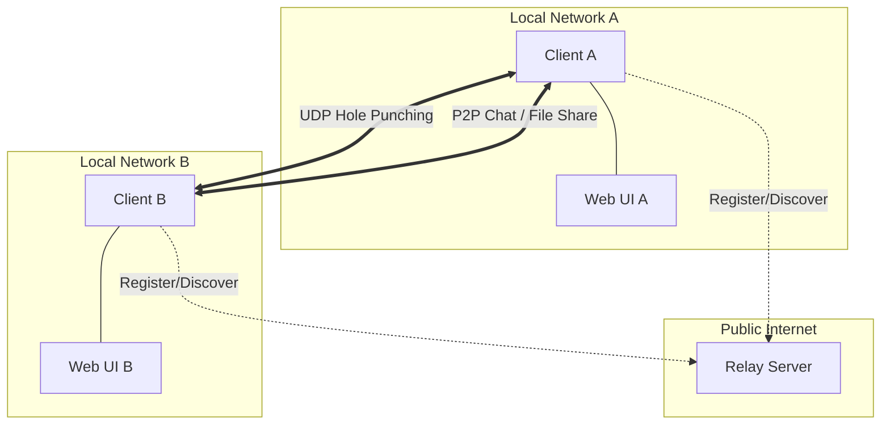

# GOP2P
A peer-to-peer chat and file sharing system using UDP.

## Architecture

The system consists of three main components:

- **Relay Server**: A public UDP server that coordinates NAT traversal and peer discovery.
- **Client**: A Go backend that handles identity management, P2P networking, messaging, and file transfers. It also serves a local web interface.
- **Web UI**: A React-based frontend that communicates with the client via WebSockets and REST.

## Project Structure

```text
.
├── client/          # Go Client source code
├── server/          # Relay Server source code
├── protocol/        # Shared P2P communication protocols
├── web/             # React Frontend source code
```

## Build Instructions

### Prerequisites
- [Go](https://go.dev/doc/install) (v1.24+)
- [Node.js](https://nodejs.org/) & npm (for building the web assets)

### Build All
```bash
make all
```
This command will:
1. Build the frontend assets (`web/dist`).
2. Build the Go client, embedding the frontend assets into the binary.
3. Build the Go server.
4. Place all binaries in the `build/` directory.

## Running the System

### 1. Start the Relay Server
```bash
./build/server
# Listens on 0.0.0.0:8080 by default
```

### 2. Start Clients
Open two terminal windows and start two clients:

**Client A:**
```bash
./build/client -name Alice -api 8081 -udp 3001
```

**Client B:**
```bash
./build/client -name Bob -api 8082 -udp 3002
```

### 3. Use the Interface
1. Open the UI: `http://localhost:8081` (Client A) and `http://localhost:8082` (Client B).
2. Connect peers.
3. Start chatting or sharing files!

